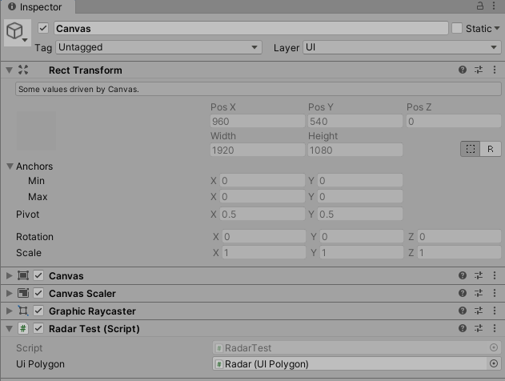

# UGUI制作雷达图

效果如下


## 实现原理
在UGUI中，不管是RawImage、Image还是Text，它们都是继承MaskableGraphic的，而MaskableGraphic又是继承Graphic的，在Graphic中有个OnPopulateMesh方法。
```cs
protected virtual void OnPopulateMesh(VertexHelper vh);
```
参数是**VertexHelper**，我们可以通过VertexHelper添加顶点，从而实现多边形的绘制。

画成图就是这样子：

## 开始制作雷达图
Hierarchy层级视图如下：Bg为多边形背景图，Rader为绘制多边形的UI





主要代码如下：
::: code-tabs#shell
@tab RadarTest
``` cs
using System.Collections;
using System.Collections.Generic;
using UnityEngine;

/// <summary>
/// 测试雷达图
/// </summary>
public class RadarTest : MonoBehaviour
{
    public UIPolygon uiPolygon;
    List<float> datas = new List<float>();

    void Start()
    {
        // 防御力
        datas.Add(0.92f);
        // 智力
        datas.Add(0.31f);
        // 灵巧
        datas.Add(0.36f);
        // 力量
        datas.Add(0.28f);
        // 敏捷
        datas.Add(0.35f);
        uiPolygon.DrawPolygon(datas);
    }

    private void Update()
    {
        if(Input.GetMouseButtonDown(0))
        {
            for(int i=0,cnt = datas.Count;i<cnt;++i)
            {
                datas[i] = Random.Range(0f, 1f);
            }
            // 重新随机雷达数据
            uiPolygon.DrawPolygon(datas);
        }
    }

}
```
@table UIPolygon
``` cs
using UnityEngine.UI;
using UnityEngine;
using System.Collections.Generic;

/// <summary>
/// UI多边形
/// </summary>
public class UIPolygon : MaskableGraphic
{
    [SerializeField]
    Texture m_Texture;
    /// <summary>
    /// 填充
    /// </summary>
    public bool fill = true;

    /// <summary>
    /// 边数
    /// </summary>
    [Range(3, 360)]
    public int sides = 3;
    /// <summary>
    /// 旋转角度
    /// </summary>
    [Range(0, 360)]
    public float rotation = 0;
    /// <summary>
    /// 顶点数组
    /// </summary>
    [Range(0, 1)]
    public float[] VerticesDistances = new float[3];

    private float size = 0;

    public override Texture mainTexture
    {
        get
        {
            return m_Texture == null ? s_WhiteTexture : m_Texture;
        }
    }

    public Texture texture
    {
        get
        {
            return m_Texture;
        }
        set
        {
            if (m_Texture == value) return;
            m_Texture = value;
            SetVerticesDirty();
            SetMaterialDirty();
        }
    }
    #region 提供外部的接口
    public void DrawPolygon(int _sides)
    {
        sides = _sides;
        VerticesDistances = new float[_sides + 1];
        for (int i = 0; i < _sides; i++) VerticesDistances[i] = 1;
    }

    public void DrawPolygon(List<float> datas)
    {
        List<float> finalDatas = new List<float>(datas);
        sides = finalDatas.Count;
        // 加上最后一个点，最后一个点与第一个点重合
        finalDatas.Add(finalDatas[0]);
        VerticesDistances = finalDatas.ToArray();
        // 触发重绘
        SetVerticesDirty();
    }
    #endregion

    void Update()
    {
        // 根据宽高适配尺寸
        size = rectTransform.rect.width;
        if (rectTransform.rect.width > rectTransform.rect.height)
            size = rectTransform.rect.height;
        else
            size = rectTransform.rect.width;
    }

    protected UIVertex[] SetVertexs(Vector2[] vertices, Vector2[] uvs)
    {
        UIVertex[] vbo = new UIVertex[4];
        for (int i = 0; i < vertices.Length; i++)
        {
            var vert = UIVertex.simpleVert;
            vert.color = color;
            vert.position = vertices[i];
            vert.uv0 = uvs[i];
            vbo[i] = vert;
        }
        return vbo;
    }

    /// <summary>
    /// 重写OnPopulateMesh方法
    /// </summary>
    /// <param name="vh"></param>
    protected override void OnPopulateMesh(VertexHelper vh)
    {
        vh.Clear();
        Vector2 prevX = Vector2.zero;
        Vector2 prevY = Vector2.zero;
        Vector2 uv0 = new Vector2(0, 0);
        Vector2 uv1 = new Vector2(0, 1);
        Vector2 uv2 = new Vector2(1, 1);
        Vector2 uv3 = new Vector2(1, 0);
        Vector2 pos0;
        Vector2 pos1;
        Vector2 pos2;
        Vector2 pos3;
        float degrees = 360f / sides;
        int vertices = sides + 1;
        if (VerticesDistances.Length != vertices)
        {
            VerticesDistances = new float[vertices];
            for (int i = 0; i < vertices - 1; i++) VerticesDistances[i] = 1;
        }
        // 最后一个顶点，也即是第一个顶点
        VerticesDistances[vertices - 1] = VerticesDistances[0];
        for (int i = 0; i < vertices; i++)
        {
            float outer = -rectTransform.pivot.x * size * VerticesDistances[i];
            float inner = -rectTransform.pivot.x * size * VerticesDistances[i];
            float rad = Mathf.Deg2Rad * (i * degrees + rotation);
            float c = Mathf.Cos(rad);
            float s = Mathf.Sin(rad);
            uv0 = new Vector2(0, 1);
            uv1 = new Vector2(1, 1);
            uv2 = new Vector2(1, 0);
            uv3 = new Vector2(0, 0);
            pos0 = prevX;
            pos1 = new Vector2(outer * c, outer * s);
            if (fill)
            {
                pos2 = Vector2.zero;
                pos3 = Vector2.zero;
            }
            else
            {
                pos2 = new Vector2(inner * c, inner * s);
                pos3 = prevY;
            }
            prevX = pos1;
            prevY = pos2;
            vh.AddUIVertexQuad(SetVertexs(new[] { pos0, pos1, pos2, pos3 }, new[] { uv0, uv1, uv2, uv3 }));
        }
    }
}
```