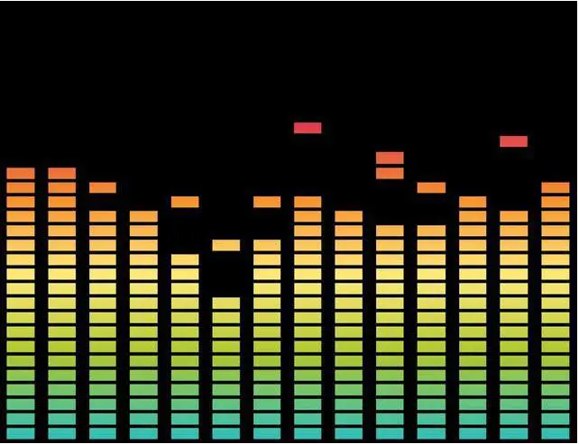

# 音乐节拍检测

- 声音：一种波动，通过空气分子有节奏的震动进行传递。
- 声音频率Hz：声音每秒种震动的次数，以赫兹Hz 表示。频率越高，音高越高。
- 分贝dB：量度两个相同单位之数量比例的单位,可表示声音的强度单位。
- 人耳可听到的声波频率：每秒振动20次到20000次的范围内，既20赫兹至20000赫兹之间，。
- 采样Sampling：在信号处理程序中，将连续信号（例如声波）降低成离散信号（一系列样本数据）。
- 采样率Sampling Rate:每秒从连续信号中提取并组成离散信号的采样个数，一般为44100单位也是赫兹。
- 快速傅里叶变换FFT:一种算法，可用来转换信号。
- 窗函数Window Function:在信号处理之中，用来降低信噪比的一种算法。
- 信噪比：
  - 噪讯比越高的话,声音的大音量和小音量的音量差会越大(音质猛爆)。
  -  噪讯比越低的话,声音的大音量和小音量的音量差会越小(音质柔和)。
## 声能检测算法检测节拍
声能检测算法其实就是根据频谱中采样的值来计算的。



上面是一张频谱图，其中的一列就是一个采样。

声能检测算法公式如下：
$$
E = \frac{1} {43} \sum_{i=1}^{43} {(E [i]^2)  }
$$
其中E代表一个瞬间（可以理解为一帧）中1024个采样的值，用这个值和历史上的43个瞬间的平均采样值作比较，如果这一瞬间的采样值优于历史上43个瞬间的采样值的平均值，那么可以把这一个瞬间视为节拍。
::: code-tabs#shell
@tab AudioVIsoulization 
```cs
using System;
using System.Collections;
using System.Collections.Generic;
using UnityEngine;

public class AudioVIsoulization : MonoBehaviour {
    
    AudioSource audio;  //声源
    float[] sample = new float[1024];   //存放频谱数据的数组长度
    LineRenderer lineRenderer;  //画线
    public GameObject cube; //预制体
    Transform[] cubeTransform;  //cube预制体的位置
    Vector3 cubePos;        //中间位置，用以对比cube位置与此帧的频谱数据
    float samplePower = 0;    //瞬时总采样样本能量(1024个采样样本的能量和)
    List<float> oldSamplePower = new List<float>(); //历史总采样样本能量(统计43个采样样本能量)
    //整首歌全部样本的总和
    List<float> allSample = new List<float>();
    //平均值
    float avg = 51974.39f;
    float MaxSample = 221645.5f;

    // Use this for initialization
    void Start () {
        GameObject tempCube;
        audio = GetComponent<AudioSource>();    //获取声源组件
        lineRenderer = GetComponent<LineRenderer>();    //获取画线组件
        lineRenderer.positionCount = sample.Length; //设定线段的片段数量
        cubeTransform = new Transform[sample.Length];   //设定数组长度
        //将脚本所挂载的gameobject向左移动，使得生成的物体的中心正对摄像机
        transform.position=new Vector3(-sample.Length*0.5f,transform.position.y,transform.position.z);
        //生成cube，将其位置信息传入cubeTransform数组，并将其设置为脚本所挂载的gameobject的子物体
        for(int i = 0;i<sample.Length;i++)
        {
            tempCube=Instantiate(cube,new Vector3(transform.position.x+i,transform.position.y,transform.position.z),Quaternion.identity);
            cubeTransform[i] = tempCube.transform;
            cubeTransform[i].parent=transform;
        }
   
    }
    
    void Update() {
        //获取频谱
        audio.GetSpectrumData(sample,0,FFTWindow.BlackmanHarris);
        //循环
        for (int i = 0; i < sample.Length; i++)
        {
            //根据频谱数据设置中间位置的y值，根据对应的cubeTransform的位置，设置x、z的值
            //使用Mathf.Clamp将中间位置的y限制在一定范围内,避免过大
            //频谱是越向后越小的，为避后面的数据变化不明显，故扩大samples[i]时，乘50+i*i*0.5f

            //单个采样样本能量
            //float y = Mathf.Clamp(sample[i] * (50 + i * i * 0.5f), 0, 200);
            float y = sample[i] * (50 + i * i * 0.5f);
            //float y = sample[i];

            cubePos.Set(cubeTransform[i].position.x, y, cubeTransform[i].position.z);

            //累计瞬时总采样样本能量
            samplePower += y;

            //画线，为使线不会与cube重合，故高度减一
            lineRenderer.SetPosition(i,cubePos-Vector3.up);
            //当cube的y值小于中间位置cubePos的y值时，cube的位置变为cubePos的位置
            if(cubeTransform[i].position.y<cubePos.y)
            {
                cubeTransform[i].position=cubePos;
            }else if(cubeTransform[i].position.y>cubePos.y)
            {
                cubeTransform[i].position-=new Vector3(0,0.5f,0);
            }
        }

        //累计总采样样本 
        allSample.Add(samplePower);
        //更新最大样本
        MaxSample = MaxSample > samplePower ? MaxSample : samplePower;

        if (oldSamplePower.Count == 43)
        {
            //计算历史采样样本能量的总值
            float OldSamplePowerCount = 0;
            for (int i = 0; i < oldSamplePower.Count; i++)
            {
                OldSamplePowerCount += oldSamplePower[i];
            }

            //计算是否为节拍

            float oldSamplePowerAvg = (OldSamplePowerCount / oldSamplePower.Count) * 1.3f;

            if (samplePower > oldSamplePowerAvg)
            {
                //Debug.Log(Time.time + " " + samplePower + " " + oldSamplePowerAvg);
                GetComponent<tap>().Tap(samplePower > avg * 1.3 ? true : false, Convert.ToInt32(13 * samplePower / MaxSample));
            }

            //更新历史采样能量
            oldSamplePower.RemoveAt(0);
            oldSamplePower.Add(samplePower);
        }
        else
        {
            //更新历史采样能量
            oldSamplePower.Add(samplePower);
        }

        //清空瞬时采样能量
        samplePower = 0;

        if (!audio.isPlaying)
        {
            GetComponent<tap>().Save();
            float allSam = 0;
            for (int i = 0; i < allSample.Count; i++)
            {
                allSam += allSample[i];
            }
            Debug.Log(allSam / allSample.Count + "平均值");
            Debug.Log(MaxSample + "最大值");
        }
    }

    IEnumerator GetBeat()
    {
        while (true)
        {
            //Beat();
            yield return new WaitForSeconds(0.01f);
        }
    }
}
```
@tab tap
```cs 
using System.Collections;
using System.Collections.Generic;
using UnityEngine;
using LitJson;
using System.IO;

public class tap : MonoBehaviour {

    string s = "";

    public void Tap(bool isHight,int num)
    {
        num++;
        s += Time.time + " " + isHight + " " + num + "\r\n";
    }

    public void Save()
    {
        string path = Application.streamingAssetsPath + "/Spectre.txt";
        StreamWriter sw = new StreamWriter(path);
        sw.Write(s);
        sw.Close();
    }
}
```


